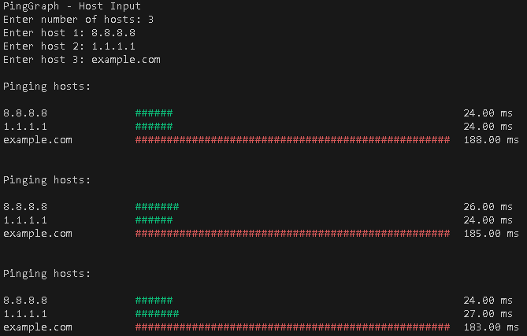

<p align="center">
    
</p>

<h1 align="center">PingGraph</h1>

## Description

PingGraph is a terminal based C program that continuously measures and visualizes the network latency (ping) to multiple hosts.  
It displays a live bar graph in the console, tracks statistics and supports machine readable exports.

## How It Works

1. Pings each host once per interval or just once (`--once`).
2. Parses and extracts the latency from the system `ping` command.
3. Visualizes the latency using a color coded ASCII bar.
4. Tracks min / max / average latency and timeouts for each host.
5. Logs results to a file or exports as JSON/CSV on demand.
6. Displays a final summary if requested.

## Features

- Interactive or file based host input.
- Live bar graph with latency color codes.
- JSON output (`--json`).
- CSV export (`--csv <file>`).
- Interval mode (`--interval N`) or limited rounds (`--limit N`).
- Summary view (`--summary`).
- Timeout tracking.
- ANSI color toggle (`--no-color`).
- Log to file with append support (`--log-append`).

## Requirements

- A C compiler (GCC or MSVC).
- POSIX compatible system or Windows.
- System `ping` command available in PATH.

## Usage

Compile:

```bash
gcc main.c -o pinggraph
```

Run with interactive input:

```bash
./pinggraph
```

Run with host file:

```bash
./pinggraph --hosts hosts.txt --interval 5 --summary
```

Print as JSON:

```bash
./pinggraph --once --json
```

Export as CSV:

```bash
./pinggraph --once --hosts hosts.txt --csv results.csv
```

## Host File Format

Simple plain text file, one host per line:

```
8.8.8.8
cloudflare.com
```

## Output Example



## Notes

- Works best in a terminal that supports ANSI colors.
- For consistent results, run with administrator/root privileges.
- To stop the program during live execution, press `Ctrl+C`.
